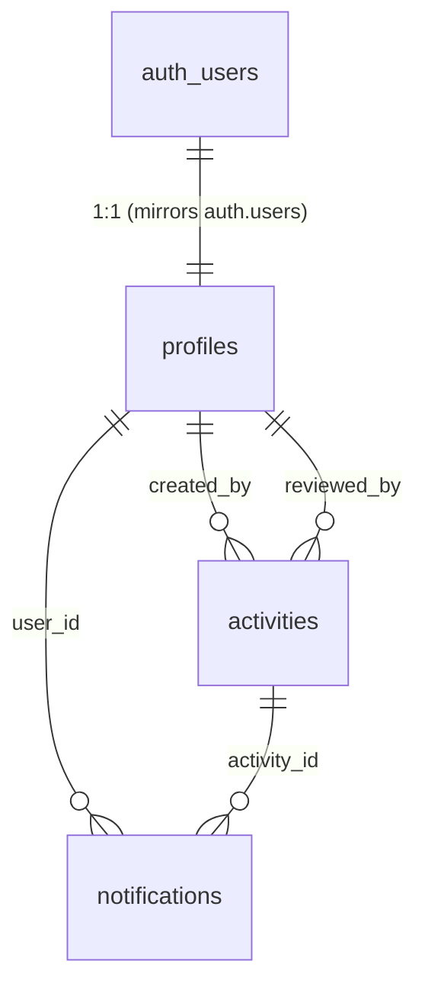

# Math Club FER — Architectural Blueprint

> **Lead Architect's complete plan.**  
> Tech stack: Next.js 14 (App Router), Tailwind CSS, Supabase (PostgreSQL), Nodemailer/SMTP.  
> Generated: 2026-06-23

---

## Table of Contents

1. [Phase 1: Database Architecture](#phase-1-database-architecture)
2. [Phase 2: Project Architecture & Directory Structure](#phase-2-project-architecture--directory-structure)
3. [Phase 3: Backend API Contracts & Server Logic](#phase-3-backend-api-contracts--server-logic)
4. [Phase 4: Step-by-Step Implementation Roadmap](#phase-4-step-by-step-implementation-roadmap)
5. [Appendix: Key Design Decisions](#appendix-key-design-decisions)

---

## Phase 1: Database Architecture

### 1.1 Entity-Relationship Overview



### 1.2 Tables

#### `profiles`

| Column | Type | Description |
|---|---|---|
| `id` | `UUID` PK → `auth.users(id)` | Cascades on user deletion |
| `email` | `TEXT NOT NULL` | Redundant but avoids joins |
| `full_name` | `TEXT` | From `raw_user_meta_data` at signup |
| `role` | `user_role` (`'user'` \| `'admin'`) | Default `'user'` |
| `created_at` | `TIMESTAMPTZ` | Auto |
| `updated_at` | `TIMESTAMPTZ` | Auto (trigger) |

**Design rationale:** `auth.users` is the Supabase-owned auth table. `profiles` extends it with app-specific fields. A `handle_new_user` trigger auto-creates a profile row on every `auth.users` INSERT.

#### `activities`

| Column | Type | Description |
|---|---|---|
| `id` | `UUID` PK | |
| `created_by` | `UUID FK → profiles(id)` | Activity author |
| `title` | `TEXT NOT NULL` | |
| `activity_type` | `activity_type` enum | `lecture` / `discussion` / `problem_solving_session` |
| `start_time` | `TIMESTAMPTZ NOT NULL` | |
| `end_time` | `TIMESTAMPTZ NOT NULL` | Constraint: `end_time > start_time` |
| `location` | `TEXT` | Room / building |
| `description` | `TEXT` | |
| `prerequisites` | `TEXT` | |
| `target_audience` | `TEXT` | |
| `status` | `activity_status` enum | `pending` → `approved` / `rejected` |
| `admin_comment` | `TEXT` nullable | Filled on denial |
| `reviewed_by` | `UUID FK → profiles(id)` nullable | Admin who acted |
| `reviewed_at` | `TIMESTAMPTZ` nullable | When the action happened |
| `created_at` | `TIMESTAMPTZ` | Auto |
| `updated_at` | `TIMESTAMPTZ` | Auto (trigger) |

**iCalendar future-proofing:** The rows contain all fields needed by the iCalendar standard (`DTSTART`, `DTEND`, `SUMMARY`, `DESCRIPTION`, `LOCATION`). Generating a `.ics` file is a matter of formatting these fields per RFC 5545.

#### `notifications`

| Column | Type | Description |
|---|---|---|
| `id` | `UUID` PK | |
| `user_id` | `UUID FK → profiles(id)` | Recipient |
| `activity_id` | `UUID FK → activities(id)` nullable | Linked activity (SET NULL on delete) |
| `type` | `TEXT` | `'approved'`, `'rejected'`, `'info'` |
| `message` | `TEXT NOT NULL` | Human-readable |
| `is_read` | `BOOLEAN DEFAULT false` | |
| `created_at` | `TIMESTAMPTZ` | Auto |

### 1.3 Row Level Security (RLS) Summary

| Table | Anonymous | Authenticated User | Admin |
|---|---|---|---|
| `profiles` | Read | Read all, Update own | Read all, Update any |
| `activities` | Read `approved` only | Read `approved` + own; Create; Update/Delete own `pending` | Full CRUD |
| `notifications` | None | Read/Update own | Read all, Insert for any user |

### 1.4 Domain Lock

A `BEFORE INSERT` trigger on `auth.users` enforces: email must match `@fer.hr` or `@student.fer.hr`. This runs at the database level so it cannot be bypassed by the client.

The full SQL is in `supabase/schema.sql`.

---

## Phase 2: Project Architecture & Directory Structure

```
MatSekApp/
├── supabase/
│   └── schema.sql                    # Complete DDL + RLS + triggers
├── copilot-instructions/
│   └── math_club_app_prompt_template.md
├── .env.local.example                # Environment variable template
├── package.json
├── tsconfig.json
├── next.config.js
├── tailwind.config.ts
├── postcss.config.js
└── src/
    ├── middleware.ts                  # Auth guard + admin route protection
    ├── app/
    │   ├── globals.css               # Tailwind directives + CSS variables
    │   ├── layout.tsx                # Root layout (Inter font, metadata)
    │   ├── page.tsx                  # Landing page (public)
    │   │
    │   ├── (auth)/                   # Route group: auth pages (no layout wrapper)
    │   │   ├── login/page.tsx
    │   │   ├── register/page.tsx
    │   │   └── verify/page.tsx
    │   │
    │   ├── (dashboard)/              # Route group: protected pages (layout with navbar)
    │   │   ├── layout.tsx            # Shared layout: navbar, unread count, admin link
    │   │   ├── calendar/page.tsx     # Public calendar (approved activities)
    │   │   ├── activities/
    │   │   │   ├── [id]/page.tsx     # Activity detail view
    │   │   │   └── new/page.tsx      # Activity proposal form
    │   │   ├── notifications/
    │   │   │   └── page.tsx          # User notifications list
    │   │   ├── admin/
    │   │   │   ├── page.tsx          # Admin dashboard (pending activities list)
    │   │   │   └── review/[id]/
    │   │   │       └── page.tsx      # Admin review: approve/deny single activity
    │   │   └── profile/
    │   │       └── page.tsx          # User profile + their activities
    │   │
    │   └── api/
    │       ├── auth/
    │       │   ├── register/route.ts # POST — signup with domain validation
    │       │   ├── verify/route.ts   # POST — email verification via OTP
    │       │   └── login/route.ts    # POST — sign in
    │       ├── activities/
    │       │   ├── route.ts          # GET (list), POST (create)
    │       │   └── [id]/
    │       │       ├── route.ts      # GET, PATCH, DELETE
    │       │       ├── approve/route.ts  # POST — admin approval
    │       │       └── deny/route.ts     # POST — admin denial + comment
    │       └── notifications/
    │           └── route.ts          # GET (list), PATCH (mark read)
    │
    ├── components/                   # Reusable UI components
    │   ├── ui/                       # shadcn-style primitives (Button, Card, Badge…)
    │   ├── calendar/
    │   ├── activities/
    │   ├── auth/
    │   ├── admin/
    │   ├── notifications/
    │   └── layout/
    │
    ├── hooks/
    │   ├── index.ts                  # useProfile, useUnreadCount
    │   └── useLogout.ts
    │
    ├── lib/
    │   ├── utils.ts                  # cn() helper (clsx + tailwind-merge)
    │   ├── email.ts                  # Nodemailer transport + email templates
    │   └── supabase/
    │       ├── server.ts             # createServerClient (cookies), createAdminClient
    │       ├── client.ts             # createBrowserClient
    │       └── index.ts              # barrel export
    │
    └── types/
        └── index.ts                  # All TypeScript interfaces, enums, constants
```

### Key Architectural Decisions

| Decision | Rationale |
|---|---|
| **Route groups** `(auth)` and `(dashboard)` | Separate unauthenticated vs. authenticated layouts without affecting URL paths |
| **Server Components by default** | `calendar/page.tsx`, `activities/[id]/page.tsx`, `admin/page.tsx` are RSCs — they fetch data directly with `createServerClient()`, no loading spinners needed |
| **Client Components where needed** | Forms (`new/page.tsx`, `review/[id]/page.tsx`) and auth pages use `"use client"` for state + browser Supabase client |
| **Middleware for route protection** | `src/middleware.ts` checks session on all `/dashboard/*` and `/admin/*` routes; redirects to `/login` or `/calendar` accordingly |
| **`createAdminClient()` for service_role** | Used only in `approve/route.ts` and `deny/route.ts` to insert notifications (bypasses RLS for the `notifications` table) |
| **Zod not yet integrated** | TypeScript interfaces + manual validation in route handlers suffice for MVP; Zod can be layered on in a later iteration |

---

## Phase 3: Backend API Contracts & Server Logic

### 3.1 API Endpoint Summary

| Method | Endpoint | Auth | Description |
|---|---|---|---|
| `POST` | `/api/auth/register` | Public | Create user (domain lock enforced) |
| `POST` | `/api/auth/verify` | Public | Verify email with OTP |
| `POST` | `/api/auth/login` | Public | Sign in |
| `POST` | `/api/auth/forgot-password` | Public | Send a password-recovery code |
| `POST` | `/api/auth/reset-password` | Public | Redeem the code and set a new password |
| `GET` | `/api/activities` | Public* | List activities (filtered by role) |
| `POST` | `/api/activities` | User | Create activity (status → `pending`) |
| `GET` | `/api/activities/[id]` | Public* | Get single activity (RLS-filtered) |
| `PATCH` | `/api/activities/[id]` | Owner/Admin | Update activity |
| `DELETE` | `/api/activities/[id]` | Owner/Admin | Delete activity |
| `POST` | `/api/activities/[id]/approve` | Admin | Approve + notify + email |
| `POST` | `/api/activities/[id]/deny` | Admin | Deny with comment + notify + email |
| `GET` | `/api/notifications` | User | List own notifications |
| `PATCH` | `/api/notifications` | User | Mark as read (bulk or individual) |

*Public endpoints return only `approved` activities to anonymous users. Authenticated users additionally see their own activities regardless of status. Admins see everything.

### 3.2 Approve / Deny Flow

```
POST /api/activities/[id]/approve (Admin only)
│
├─ 1. Authenticate (getSession)
├─ 2. Authorize (profiles.role === 'admin')
├─ 3. Verify activity exists and is 'pending'
├─ 4. UPDATE activities SET status='approved', reviewed_by=..., reviewed_at=...
├─ 5. INSERT INTO notifications (user_id, type='approved', message)
├─ 6. sendEmail() → creator's @fer.hr address
└─ 7. Return updated activity

POST /api/activities/[id]/deny (Admin only)
│
├─ 1-3. Same as approve
├─ 4. Validate admin_comment is non-empty
├─ 5. UPDATE with status='rejected' + admin_comment
├─ 6. INSERT notification (type='rejected')
├─ 7. sendEmail() with denial reason
└─ 8. Return updated activity
```

### 3.3 Nodemailer SMTP Setup

The utility at `src/lib/email.ts`:

- **Transport:** Singleton `nodemailer.createTransport` with `host`, `port`, `auth` from environment variables.
- **TLS:** Automatic — `secure: true` if port 465, otherwise `STARTTLS`.
- **Templates:** Two pre-built HTML templates:
  - `verificationEmailTemplate(fullName, verifyUrl)`
  - `activityStatusEmailTemplate(fullName, activityTitle, status, comment, url)`

Both templates use inline CSS with the brand color palette. Croatian text (`hr` locale).

### 3.4 Standard API Response Envelope

```typescript
interface ApiResponse<T = unknown> {
  success: boolean;
  data?: T;
  error?: string;
}
```

All endpoints return this. HTTP status codes follow REST conventions:
- `200` — success with data
- `201` — resource created
- `400` — validation error
- `401` — unauthenticated
- `403` — unauthorized (wrong role)
- `404` — not found
- `500` — server error

---

## Phase 4: Step-by-Step Implementation Roadmap

### Phase 1: Foundation — Supabase, Schema, Auth (Days 1–2)

**Goal:** Users can register, verify email, log in, and see their profile.

| Step | Task | Files |
|---|---|---|
| 1.1 | Create Supabase project, run `supabase/schema.sql` in SQL Editor | `schema.sql` |
| 1.2 | Scaffold Next.js app: `package.json`, `tsconfig`, `tailwind`, `postcss`, `globals.css` | Config files |
| 1.3 | Supabase clients: `server.ts`, `client.ts` | `src/lib/supabase/` |
| 1.4 | Types: `Profile`, `Activity`, `Notification`, `ApiResponse`, enums | `src/types/index.ts` |
| 1.5 | Auth API: register, verify, login routes | `src/app/api/auth/*/route.ts` |
| 1.6 | Auth pages: login, register, verify | `src/app/(auth)/` |
| 1.7 | Middleware: protect `/dashboard/*` and `/admin/*` | `src/middleware.ts` |
| 1.8 | Landing page (`/`) | `src/app/page.tsx` |

**Verify:** Register with `test@fer.hr`, check Supabase dashboard for the profile row, log in, verify redirect to `/calendar`.

---

### Phase 2: Activities CRUD & Calendar (Days 3–4)

**Goal:** Authenticated users can propose activities. Admin can view all. Public calendar shows approved.

| Step | Task | Files |
|---|---|---|
| 2.1 | Activities API: GET (list), POST (create) | `src/app/api/activities/route.ts` |
| 2.2 | Activity detail API: GET, PATCH, DELETE (by id) | `src/app/api/activities/[id]/route.ts` |
| 2.3 | Dashboard layout with navbar + unread badge | `src/app/(dashboard)/layout.tsx` |
| 2.4 | Calendar page (SSR, approved activities) | `src/app/(dashboard)/calendar/page.tsx` |
| 2.5 | Activity detail page | `src/app/(dashboard)/activities/[id]/page.tsx` |
| 2.6 | "New activity" form (Client Component) | `src/app/(dashboard)/activities/new/page.tsx` |
| 2.7 | Profile page (own activities list) | `src/app/(dashboard)/profile/page.tsx` |
| 2.8 | Hooks: `useProfile`, `useUnreadCount` | `src/hooks/` |

**Verify:** Create an activity, see it appear in your profile as "pending", confirm it does NOT appear on `/calendar`. Then manually set status to `approved` in Supabase dashboard — confirm it appears on calendar.

---

### Phase 3: Admin Workflow & Notifications (Days 5–6)

**Goal:** Admins can approve/deny activities. Notifications are created and emailed.

| Step | Task | Files |
|---|---|---|
| 3.1 | Approve + Deny API routes (notification creation + email) | `src/app/api/activities/[id]/approve/route.ts`, `deny/route.ts` |
| 3.2 | Nodemailer SMTP utility + HTML templates | `src/lib/email.ts` |
| 3.3 | Admin dashboard (pending activities list, SSR) | `src/app/(dashboard)/admin/page.tsx` |
| 3.4 | Admin review page (approve/deny UI, Client Component) | `src/app/(dashboard)/admin/review/[id]/page.tsx` |
| 3.5 | Notifications API: GET (list), PATCH (mark read) | `src/app/api/notifications/route.ts` |
| 3.6 | Notifications page (list + link to activity) | `src/app/(dashboard)/notifications/page.tsx` |
| 3.7 | `.env.local` setup (SMTP credentials) | `.env.local` (from `.env.local.example`) |
| 3.8 | Promote a user to admin: `UPDATE profiles SET role='admin' WHERE email='...'` | Manual SQL |

**Verify:** Submit an activity as a regular user → log in as admin → see it in the admin panel → approve it → check the user received an email and an in-app notification → activity appears on calendar.

---

### Phase 4: Polish & Edge Cases (Days 7–8)

**Goal:** Production-ready quality.

| Step | Task |
|---|---|
| 4.1 | Email domain validation: client-side check in register form (already done) + DB trigger (already done) |
| 4.2 | Loading states, error boundaries, toast notifications |
| 4.3 | Responsive calendar: mobile-friendly grid/cards |
| 4.4 | Accessibility pass (focus rings, aria labels, semantic HTML) |
| 4.5 | iCalendar export: `GET /api/activities/[id]/ics` returning `text/calendar` |
| 4.6 | `.env.local.example` → ensure all vars documented |
| 4.7 | README with setup instructions |

---

### Phase 5: Deployment (Day 9)

| Step | Task |
|---|---|
| 5.1 | Push to GitHub |
| 5.2 | Deploy to Vercel (connect repo, set env vars) |
| 5.3 | Configure Supabase production project (separate from dev) |
| 5.4 | Run schema migration on production Supabase |
| 5.5 | Set up custom domain (mathclub.fer.hr) |
| 5.6 | SSL/TLS verification for SMTP |

---

## Appendix: Key Design Decisions

### Why Supabase Auth instead of NextAuth?

- Supabase Auth integrates directly with PostgreSQL RLS — no extra session management layer.
- The `profiles` table is auto-created via trigger on `auth.users` INSERT.
- Row-Level Security policies reference `auth.uid()` natively.
- Built-in email verification (OTP) without external providers.

### Why the `profiles` table is separate from `auth.users`?

Supabase owns `auth.users` and its schema is locked. The `profiles` table is our extension point: role, full_name, and any future fields. The foreign key `profiles.id → auth.users(id) ON DELETE CASCADE` ensures cleanup.

### Why two Supabase clients (server + admin)?

- `createServerClient()` uses the `anon` key + user's session cookie. Subject to RLS. Used in Server Components and most API routes.
- `createAdminClient()` uses the `service_role` key. Bypasses RLS. Used ONLY server-side to insert notifications for other users (the approve/deny routes).

### Why not Zustand / Redux for state management?

For the MVP scope, React Server Components + fetch-in-component + URL-based state cover all needs. A lightweight client-side store can be introduced later if the notification polling or calendar state grows complex.

### How to add iCalendar export later

The `activities` table already has all RFC 5545 fields. A future endpoint:

```
GET /api/activities/[id]/ics
```

Would:
1. Fetch the activity from Supabase
2. Format as iCalendar (`BEGIN:VCALENDAR` / `BEGIN:VEVENT` / ... / `END:VCALENDAR`)
3. Return with `Content-Type: text/calendar; charset=utf-8`
4. Set `Content-Disposition: attachment; filename="activity.ics"`

No schema changes needed.
